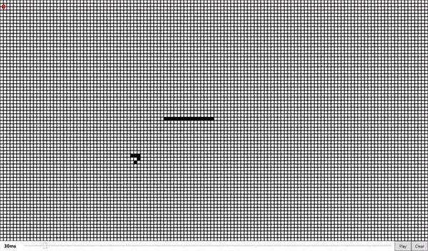

# My Game of Life

I made my own Game of Life.
The file contains the VS project with the executable of the compiled version.

## What is the Conway's game of live ?

Conway's game of life is a binary board.
each one contains a 1 if there is a cell or a 0 if there isn't.

the evolution of a cell depend on its adjacent cell:
- If a cell is surrounded by less than 2 cells it dies of isolation.
- If a cell is surrounded by more than 3 cells it dies of overpopulation
- A cell can born if its surrounded by exactly 3 cells.

This game is very interesting because it can give result to huge complex structures from these 3 simple rules.

## Interface

The window contains multiples items:
- The canvas where we can draw cells on
- The generation's number on the top left corner
- The interval between generations on the bottom left corner
- A slider where you can edit this interval
- The pause/play button on the bottom left corner
- And the clear button next to it

## Controls

- Space or Enter to start or stop a simulation
- C or R to clear the Grid
- Left click to add cells
- Right click to remove cells
